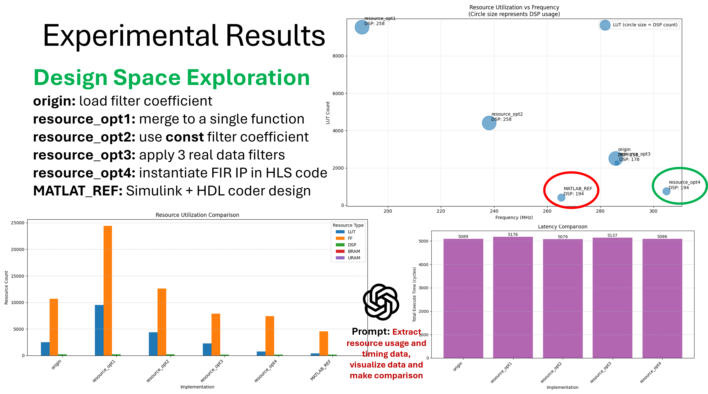

# LLM-Aided FPGA Design for Signal Processing Applications

[](https://opensource.org/licenses/MIT)

## Overview

This project demonstrates a novel approach to FPGA design by leveraging Large Language Models (LLMs) to streamline the development process from algorithmic conception to hardware implementation, applied to a pulse detector similar to the example in the [HDL Coder Self-Guided Tutorial](https://github.com/mathworks/HDL-Coder-Self-Guided-Tutorial) by MathWorks. The design concepts and implementation details are visually illustrated in the PNG images within this repository.

## Key Features

- **MATLAB to HLS C++ Conversion**: Automated translation of MATLAB DSP algorithms to HLS C++ using LLMs
- **FIR IP Core Integration**: Efficient techniques for incorporating optimized FIR IP cores within HLS designs
- **Design Space Exploration (DSE)**: LLM-guided exploration of design alternatives and optimizations
- **Automated Visualization**: Python scripts for analyzing and visualizing resource usage and timing metrics
- **Resource Efficiency**: Comparable resource utilization to optimized MATLAB HDL Coder implementations

## Project Structure

All project files are organized as follows:

```
pulseDetector/
├── MATLAB/               # MATLAB reference designs
├── HLS/                  # LLM-generated HLS C++ implementations
|   ├── origin/           # Origin version generated from MATLAB code
|   ├── resource_opt1/    # Merge to a single function
|   ├── resource_opt2/    # Use constant filter coefficient
|   ├── resource_opt3/    # Replace a complex data filter with three real data filters
│   └── resource_opt4/    # Optimized implementation with FIR IP core
└── Doc/                  # Implementation results and comparisons
    ├── *.png             # Visual diagrams of design concepts and workflows
    └── reportPrompt.md   # Prompt for generating Python code to visualize data
```

## Getting Started

### Prerequisites

- Vivado HLS (2022.2 or later recommended)
- MATLAB R2023a or later (for reference implementations)
- Python 3.8+ with matplotlib, pandas, and numpy

### Installation

1. Clone the repository:
   ```bash
   git clone https://github.com/rockyco/pulseDetector.git
   cd pulseDetector
   ```

2. Set up Python environment:
   ```bash
   python -m pip install -r requirements.txt
   ```

3. Configure Vitis HLS paths:
   ```bash
   source /path/to/Vitis_HLS/2022.2/settings64.sh
   ```

## Performance Analysis

Our LLM-aided approach achieves resource efficiency comparable to the MathWorks HDL Coder implementation:

| Metric                | LLM-Aided HLS Design | HDL Coder Design |
|-----------------------|----------------------|------------------|
| DSP Utilization       | 194                  | 194              |
| LUT Utilization       | 745                  | 407              |
| FF Utilization        | 7405                 | 4528             |
| Maximum Frequency     | 304 MHz              | 265 MHz          |

## Visual Design Documentation

Please refer to these images for a visual understanding of the project's methodology and outcomes:

- Introduction of pulse detector


- Design transformation workflow from MATLAB to HLS C++
- HLS implementation of pulse detector


- Resource utilization comparisons across implementation approaches
- Design space exploration results


## Key Insights

1. **Productivity Gains**: LLM assistance significantly reduces development time compared to traditional approaches
2. **Optimization Knowledge**: LLMs can suggest HLS pragmas and optimizations based on design patterns
3. **IP Core Integration**: The hybrid approach of combining HLS with optimized IP cores provides the best balance of development speed and hardware efficiency
4. **Design Exploration**: LLMs facilitate rapid exploration of design alternatives that might otherwise be overlooked

## Contributing

Contributions are welcome! Please feel free to submit a Pull Request.

## License

This project is licensed under the MIT License - see the LICENSE file for details.

## Acknowledgments

- MathWorks for the [HDL Coder Self-Guided Tutorial](https://github.com/mathworks/HDL-Coder-Self-Guided-Tutorial)
- The Xilinx Vitis HLS team for their comprehensive documentation
- The open-source community for contributions to FPGA design methodologies